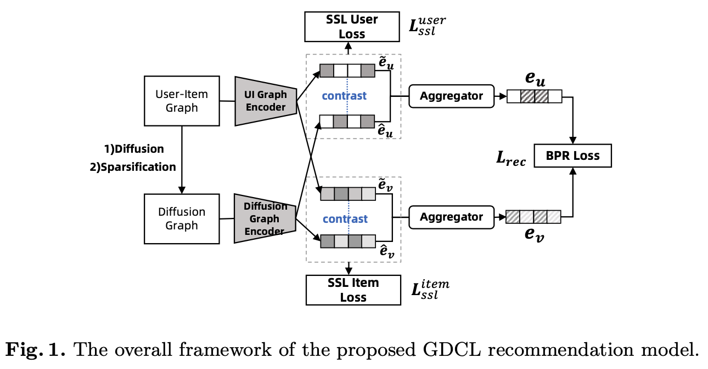
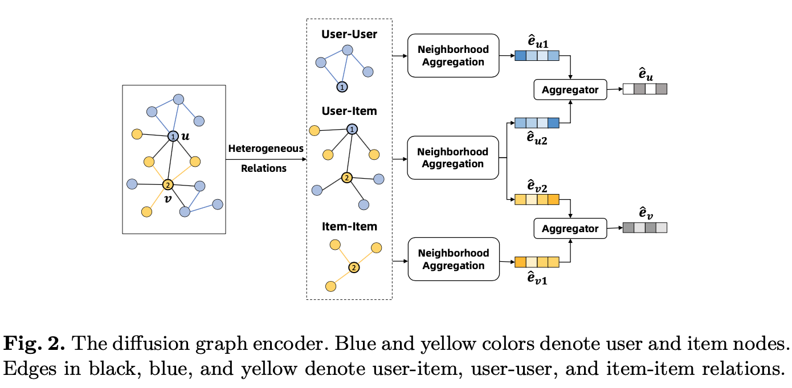

# Diffusion-Based Graph Contrastive Learning for Recommendation with Implicit Feedback


This is the implementation of the framework described in the paper:

>Lingzi Zhang, Yong Liu, Xin Zhou, Chunyan Miao, Guoxin Wang, and Haihong Tang. 
>[Diffusion-Based Graph Contrastive Learning for Recommendation with Implicit Feedback](https://dl.acm.org/doi/abs/10.1007/978-3-031-00126-0_15).
>Database Systems for Advanced Applications: 27th International Conference, DASFAA 2022

## Overview
Recent studies on self-supervised learning with graph-based recommendation models have achieved outstanding performance. 
They usually introduce auxiliary learning tasks that maximize the mutual information between representations of the original graph and its augmented views. 
However, most of these models adopt random dropout to construct the additional graph view, failing to differentiate the importance of edges. 
The insufficiency of these methods in capturing structural properties of the user-item interaction graph leads to suboptimal recommendation performance. 
In this paper, we propose a Graph Diffusion Contrastive Learning (GDCL) framework for recommendation to close this gap. 
Specifically, we perform graph diffusion on the user-item interaction graph. 
Then, the diffusion graph is encoded to preserve its heterogeneity by learning a dedicated representation for every type of relations. 
A symmetric contrastive learning objective is used to contrast local node representations of the diffusion graph with those of the user-item interaction graph for learning better user and item representations. 
Extensive experiments on real datasets demonstrate that GDCL consistently outperforms state-of-the-art recommendation methods.

<p align="center">


</p>

## Datasets
Datasets used for this paper can be downloaded from the Google Drive: [Amazon-Arts/Amazon-VideoGames/MovieLens-1m/Yelp2018](https://drive.google.com/drive/folders/1tyPL6fuzRnsqtE3FTaxanBpDrtVDEwSs?usp=sharing)  
After downloading the datasets, please unzip it and put all files under the folder ./preprocessed_data.

## Quick Start  

We first need to create a python=3.7 virtual env and activate it. Then, we should install some dependencies.
```text
conda create -n gdcl python=3.7
conda activate gdcl
pip install -r requirements.txt
```

Next, we install pytorch with the version >= 1.7.1.
```text
conda install pytorch torchvision -c pytorch
```
To alter hyper-parameters for the model, we can modify the corresponding file inside ./configs/model/GDCL.yaml. 
Detailed explanation of each hyper-parameter is also included in this file.

To train the model:
```text
python main.py --model=GDCL --dataset=arts
```


## License
If you find our code/data/models or ideas useful in your research, please consider citing the paper:
```text
@inproceedings{zhang2022diffusion,
  title={Diffusion-Based Graph Contrastive Learning for Recommendation with Implicit Feedback},
  author={Zhang, Lingzi and Liu, Yong and Zhou, Xin and Miao, Chunyan and Wang, Guoxin and Tang, Haihong},
  booktitle={Database Systems for Advanced Applications: 27th International Conference, DASFAA 2022, Virtual Event, April 11--14, 2022, Proceedings, Part II},
  pages={232--247},
  year={2022}
}
```

## Acknowledgement:
Our codebase relies on these excellent repositories:  
- [RecBole](https://github.com/RUCAIBox/RecBole)
- [SelfCF](https://github.com/enoche/SelfCF)
- [PPRGo](https://github.com/TUM-DAML/pprgo_pytorch)


